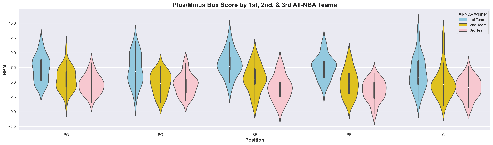
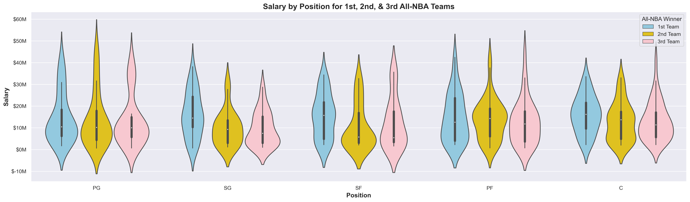
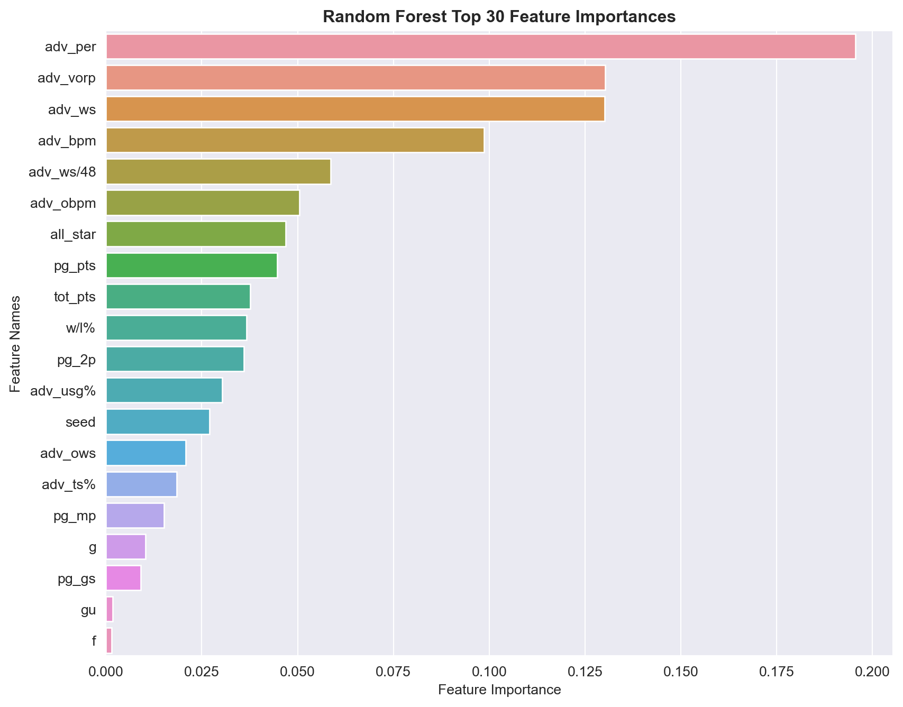

# Using Machine Learning and Sports Analytics to Optimize NBA Management and Decision-Making
---

<center><font size="3"><em>"Analytics are part and parcel of virtually everything we do now" - NBA Commissioner Adam Silver</em></font></center>

# Problem Statement

The National Basketball Association (NBA) has been increasing in popularity since it's inception in 1946, with the most drastic surge in viewership and fan engagement in the last few decades. Today, it is among the world's leading sports industries, fueled by factors such as expanding it's recruiting to the global sphere, exercising prowess in marketing, promotions, endorsements, and sponsorships, devising complex business contracts and collective bargaining agreements, partaking in \\$24B network deals, and ultimately generating over \\$10B in revenue ([_1_](https://www.premiumtimesng.com/promoted/596711-exploring-the-reasons-behind-the-success-of-the-nba.html))([_2_](https://randerson112358.medium.com/how-the-nba-uses-data-analytics-6eac3c43a096#:~:text=Most%20NBA%20teams%20have%20data,and%20track%20their%20fatigue%20levels)).

With the increase in viewership both domestically and internationally, as well as the shift towards becoming a serious business, the NBA presents abundant opportunities for management and analytics. Team executives, coaches, and decision-makers recognize the need to optimize their positions in the industry via data-driven strategies. It is more important than ever to hone and enhance each of the factors that contribute to team success, and ultimately, the bottom line of the industry.

Our objective is to help NBA team management stakeholders plan for the future of their franchise via predictive modeling and machine learning. One such way is to project and account for the salary negotiations that will take place with top and/or upcoming players. Here there exists a delicate balance between keeping top performers and assuring that team payroll is manageable. In this analysis, we have sought to proactively manage team circumstances by making a series of regression and classification models that predict: 1) All-NBA Team voter share and selection, and 2) player salaries based on performance. Our models successfully predict these targets, and therefore can be leveraged by management executives for optimal player evaluation, contract negotiation, and decision-making.

At the end of this assignment, NBA team and player stakeholders will be empowered to collaboratively create robust mutually beneficial opportunities, fostering synergy between their front office and players.

# Data Dictionary

The data sourced for this analysis came from Reddit.com, a popular platform consisting of "subreddit" communities whose members share content and have discussions on topics of their interests. Reddit posts were pulled from two subreddits: snowboarding ("snowboardingnoobs"\*) and skiing ("skiing") communities. This was done using PRAW (the Python Reddit API Wrapper), a Python library that provides an interface to interact with the Reddit API, allowing me to extract posts from my chosen subreddits. 

I collected a diverse range of Reddit posts and saved/generated the variables below, serving as the foundation for my analysis and insights.

|Feature|Type|Source|Description|
|---|---|---|---|
|**created_utc**|*float*|Reddit (Direct)|Time the submission was created, represented in Unix Time | 
|**author**|*object*|Reddit (Direct)|Reddit user who is the author of the post | 
|**score**|*integer*|Reddit (Direct)|The number of net upvotes for the submission (upvotes - downvotes) |
|**upvote_ratio**|*float*|Reddit (Direct)|The percentage of upvotes from all votes on the submission |
|**num_comments**|*integer*|Reddit (Generated)|The number of comments on the submission|
|**text**|*object*|Reddit (Generated)|A combination of the title of a post and the accompanying self text, concatenated into one variable |
|**lem_text**|*object*|Reddit (Generated)|A lemmatized version of the text column (reducing each word to its base or dictionary form, considering the word's context and part of speech) |
|**stem_text**|*object*|Reddit (Generated)|A stemmed version of the text column (reducing each word to its root form by removing prefixes/suffixes/affixes, without consideration for the word's context or part of speech) |
|**post_length**|*integer*|Reddit (Generated)|The count of characters in the text column |
|**subreddit**|*object*|Reddit (Direct)|The subreddit community, converted for analysis to 1 for snowboarding and 0 for skiing  |

Please note: The Reddit community "snowboardingnoobs" was used in lieu of the wider snowboarding community, as the snowboarding community was not available during the Pushshift API protest (see [Data Acquisition and Cleaning](#1.-Data-Acquisition-and-Cleaning)). The substitution did not negatively impact our problem statement, as we are still able to gain sufficient insights on the needs of the snowboarding community and where/how Burton Snowboards can respond to identified opportunities.

# Executive Summary

## Background and Purpose

### NBA Rise in Popularity
The NBA has experienced a remarkable surge in popularity over the past few decades, solidifying its position as one of the world's premier sports leagues. With a global fan base, passionate viewership, and widespread media coverage, the NBA has become a cultural phenomenon, transcending borders and uniting fans from diverse backgrounds. Following a decrease in revenue (\\$6.4B in the 2020-21 season) due to the COVID-19 pandemic, the league set a revenue record of \\$10B in 2022 -- which nearly tripled the annual revenue over the last decade from \\$2.7B in 2012 ([_3_](https://huddleup.substack.com/p/the-nbas-10-billion-business)). 

The NBA's future continues to look bright and revenues are only projected to increase. The average NBA franchise is currently worth \\$2.48B, a 13% increase from just one season ago, and the average value of an NBA team has increased 12x since 2001 (\\$207M to \\$2.48B) ([_4_](https://huddleup.substack.com/p/the-nbas-10-billion-business)). As revenue increases, player contracts, team payrolls, and league salary caps are all projected to continue increasing in tandem. This makes it ever more crucial for players and teams to manage their contracts well and plan effectively for the future in ways that best position their teams for success.

Through machine learning, we can develop innovative ways to help NBA team managers plan their rosters and budgets, as well as make an impact on the league by continually raising the level of play. Sophisticated analytics can assist in player evaluations, salary management, injury prevention, team planning, and contract negotiations and budgeting, ultimately optimizing team performance and fostering success ([_5_](https://randerson112358.medium.com/how-the-nba-uses-data-analytics-6eac3c43a096#:~:text=Most%20NBA%20teams%20have%20data,and%20track%20their%20fatigue%20levels))([_6_](https://knowledge.wharton.upenn.edu/article/nbas-adam-silver-analytics-transforming-basketball/)). 


[Source: statista.com](https://www.statista.com/statistics/193467/total-league-revenue-of-the-nba-since-2005/)

### Player Salaries and All-NBA Team Selection
Player salaries make up a critical part of every teams planning process, as this impacts the team payroll, the taxes to be paid if the salary cap is exceeded, and ultimately the financial flexibility and competitiveness of the team in acquiring and retaining talent. Player salaries, along with other financial considerations, play a crucial role in shaping a team's roster, strategic decisions, and long-term success in the highly competitive landscape of the NBA. Many players have complex contracts, with incentive structures throughout based on performance and tenure with their team. 

For example, one way for a player to be eligible for a supermax contract, whereby a team can offer a longer and more lucrative deal (30-35% of the salary cap) compared to what other teams can offer the player free agency, is to be selected for an All-NBA Team: either 1st, 2nd, or 3rd teams ([_7_](https://www.hoopsrumors.com/2023/05/contract-implications-of-todays-all-nba-announcement.html))([_8_](https://en.as.com/nba/how-can-all-nba-teams-selection-affect-players-salaries-n/)). This offers a huge incentive for players, especially upcoming players who are not eligible for more than 25% of the salary cap, to be selected among the Top 15 in the league (Top 5 in 1st Team, next 5 in 2nd Team, last 5 in 3rd Team). Players receiving this league honor -- via votes cast by a group of respected sportswriters and broadcasters -- are able to make strong cases for contract negotiations, and team management executives must be prepared to make space for such negotiations whilst keeping a robust team around their "star" players.

For team management to be able to effectively navigate and forecast when these potential negotiations would take place and how much they should plan to budget, data science and modeling can be productively leveraged. We built a regression model which can accurately predict the percent of voter share a player is predicted to receive based on their performance, impact, and tenure. We used this voter share to predict the Top 15 players selected: the All-NBA Teams. We also took a more granular look at which specific team -- 1st, 2nd, or 3rd -- a player would make via classification modeling. With these insights, any stakeholder involved in team analytics and planning can impactfully be a step ahead of team management activities.

### Player Salaries and Over/Undervalued Players
Another valuable insight to be gained from current or anticipated player salaries is whether or not a contract over- or undervalues a player. By using another regression model, this time predicting player salary based on performance statistics and league tenure, we were able to determine which players may currently make too much or too little salary as percent of the league salary cap. Based on robust modeling that looks for complex relationships in historical data, we are able to make inferences about current player salaries which can leveraged by players and management alike in contract negotiations.

With the use of our models, players, agents, and management/ownership groups will be able to more effectively manage their contracts/careers or teams, make business decisions, handle financial matters, and oversee day-to-day operations. 

### Note About Future Uses of Our All-NBA Prediction Model
On July 1, 2023, the new 7-year collective bargaining agreement (CBA) was signed and will run through 2029-30. Starting in the 2023-24 season, All-NBA Team selection will be "positionless". In contrast to how current voting takes place, whereby voters select 2 Guards, 2 Forwards, and 1 Center per All-NBA team, moving forward, position will no longer be a factor. Voters will cast votes for only the Top 15 players, regardless of position.

Our models will still be valuable in a positionless setting, as it will still capture insights into the past patterns of voting and identify the factors that influenced the selection of players. Our model uses regression to predict voter share, and I anticipate it will only take a few seasons for the model to understand the relationships in a positionless setting. By acknowledging the changes in voting criteria, incorporating new features, and continuously improving the model based on feedback and real-world outcomes, we will enhance its predictive capabilities and ensure it remains relevant and effective in predicting All-NBA Team selections in a positionless context.

Read the CBA [here](https://ak-static.cms.nba.com/wp-content/uploads/sites/4/2023/06/2023-NBA-Collective-Bargaining-Agreement.pdf) and see summaries [here](https://ak-static.cms.nba.com/wp-content/uploads/sites/4/2023/06/2023-CBA-Summary.pdf) and [here](https://theathletic.com/4421655/2023/04/17/cba-minimum-games-mvp-awards/).

## Initial Findings
### Baseline Models
In order for our models to be useful, they needed to outperform the baseline models. 
- **All-NBA Team Regression Model**
    - Baseline: 0.0681 (mean of all past voter shares, similar value when took the average voter share by season and then averaged across that)
    - RMSE: 0.2009
<br></br>
- **All-NBA Team Classification Models (Multi-Class and Binary)**
    - Baseline: 0.8842
<br></br>
- **Player Salary**
    - Baseline: 0.1455 (mean of all cap-shares [salary as a percent of salary cap])
    - RMSE: 0.104

### Final Model Performance
- **All-NBA Team Regression Model**
    - Model: Extra Trees
    - Testing Score: 0.8274
    - RMSE: 0.0832
    <br></br>
- **All-NBA Team Multi-Class Classification Models**
    - Model: SVM
    - Accuracy Score: 0.9355
<br></br>
- **All-NBA Team Binary Classification Models**
    - Model: Logistic Regression
    - Accuracy Score: 0.9642
<br></br>
- **Player Salary**
    - Model: LGBM
    - Testing Score: 0.7591
    - RMSE: 0.0527
    
### General Insights
- There have been significant changes in the landscape and ecosystem of the NBA since 1990
    - Average age of players has decreased from >28 in 1998 to 26.5 in 2022
    - Average points per game has increase, likely consistent with higher entertainment value being incentivize as viewers increase
    - Average 3-pointers attempted per game has increased dramatically, this can be credited to data science and efficiency analysis
    - Team salary caps and payroll have been increasing year over year significantly, at rates much beyond inflation (having to do with growth in viewership and revenue, e.g., after the 2014 television deal)
    


### All-NBA Placements
- Once the Top 15 players are decided, granular placements from there are subject to much nuance, noise, and other external factors beyond statistics. This was made evident by high levels of misclassification in the our SVM multi-class classification model.
- Many statistics among 1st, 2nd, and 3rd team are not significantly different, such as player efficiency ranking, box score, and win share

### Salary 
- There is very high variability in NBA player salaries, even among players with similar skill levels. Factors such as experience, performance, reputation, and market demand can lead to substantial differences in compensation.
- Many star players will often show up as "Overvalued" (i.e., the difference between their actual and predicted salary is within the Top 25% of differences), as their salary often takes up a significant amount of the salary cap compared to the final algorithm used by our models.
    - Giannis Antetokounmpo, Nikola Jokic, Joel Embiid, Lebron James, and Kevin Durant were all listed as overvalued, despite high accomplishments and performance. For all these instances, the model predicted high salaries, just not _as_ high as their actuals. These players are often who teams are built around, therefore, our model must be taken in conjunction with domain knowledge to be most useful
- Role players, especially those on winning teams, are often undervalued. 
    - Demar DeRozan is a 12 year veteran starting for Golden State, he was named to the 3rd All-NBA Team and was an allstar. He is competing for salary cap share among superstars like Steph Curry and Klay Thompson, therefore his compensation may not be as high. 
    - However, as he _was_ selected as an All-NBA winner, he is subject now to negotiate a deeper contract - this may put Golden State too far beyond the salary cap to be comfortable, but it is also important they retain and reward strong role players. Our model can help anticipate situations like these and proactively engage.    
    
## Methodology and Analysis
To complete this analysis, several regression and classification models were trained and fit on historical NBA data from 1990-91 season to 2022-23 season. Before modeling could begin, we had a variety of tasks, from data pulling, to cleaning and feature engineering, to exploration. The high-level process for this analysis is outlined below.

### 1. Data Acquisition 
Predicting All-NBA Team and player salaries required an abundant amount of performance data which is available across several statistics sites, including [nba.com/stats](https://www.nba.com/stats), [basketball-reference.com](https://www.basketball-reference.com/), and [hoopshype.com](https://hoopshype.com/salaries/). Webscraping across all these sites was required to access and pull all the needed data. 

#### Data Scraped
Ultimately, the data scraped on all active players and teams from 1990-2022 included:
1. **Player Data**
    - Performance Statistics
        - Per Game
        - Totals
        - Advanced
    - NBA Draft Year
    - All-Star Selection and Number of Appearances
2. **All-NBA Team Data**
    - Winners
    - Vote-Receivers
3. **Team Data**
    - Team Rankings
    - Team Standings
4. **Salary Data**
    - Player
    - Team Payroll
    - Salary Caps
    
#### Process for Scraping
Using webscraping methods BeautifulSoup and Selenium, we first saved a snapshot of the HTML page housing our desired statistics. We then used those pages to inspect and pull the tables the interest into CSV's for further data cleaning and feature engineering. Below we describe the two scenarios encountered in our webscraping journey.

1. **Traditional Full-Page Reloading / Synchronous Loading**
    - For websites which fully reloaded from the server upon user interaction, our process was straightforward. The server would process the request, generate a new HTML page, and send it back to our browser with our full data available for inspection and scraping. 
    - We employed ```BeautifulSoup```, inspected the HTML, and were able to scrape only our tables of interest. 
    <br></br>
2. **AJAX (Asynchronous JavaScript and XML)**
    - For websites that employed a dynamic implementation using AJAX, the displayed tables were absent in the HTML document and BeautifulSoup could not be used. For these dynamic tables, our tables/rows would be rendered using JavaScript only after the page had fully loaded.
    - We leveraged the ```Selenium``` Python package, an automated browser software, for these instances. With this, we were able to dynamically interact with web pages and simulate user actions like clicking buttons, filling out forms, and navigating through various elements. 
    - For further instructions on how to install and use Selenium and it's associated webdriver, see my [Data Acquisition](./code/01_Data_Acquisition.ipynb) notebook.
 
We ensured respectful and responsible webscraping by incorporating random sleep times / rate limits of 4-6 seconds (continuous) between data pulling requests to prevent server overload and potential IP blocking.

### 2. Data Cleaning
Once our data was scraped, a vast amount of data cleaning was necessary to combine all dataset, reconcile differences, explore and fill in missings, and engineer variables that would be useful for future modeling. Our rough steps, considerations, and decisions are outlined below.

1. We built a <u>**foundational dataset**</u> by merging per-game, advanced, and total statistic
    - Each dataset required various amounts of initial cleaning, including:
        - Removing any Unnamed columns that made their way into our final scraped data
        - Removing rows which were repeat headers, also a byproduct of the HTML tables before they were scraped
        - Convert Objects to Floats
        - Prefix variables with statistic type ```pg_```, ```adv_```, ```tot_``` to enable smooth merging
     - Further manipulations needed to be made to the data once merged, for example...
        - Dummifying the Position (```Pos```) variable into 3 categories for All-NBA Team prediction and 5 categories for our salary model
        - Managing players with midseason transfers
            - These players appeared across multiple rows in our data, once for each team they played for throughout a single season. We took only the "TOT" (i.e., Total) statistics row, and for the players' Team, we listed the team they finished season with (i.e., their 'latest' team)
            - Many player names contained special characters, such as asterisks, to indicate whether a player was the MVP that season. We deleted these special characters and did not store MVP data elsewhere as this would not available yet in determining future All-Team winners. There were also special characters such as accents in player names, which we scrubbed appropriately via the ```unicodedata.normalize``` function
            <br></br>
2. Once our base dataset was built, we established a <u>**Minimum Selection Criteria**</u> for All-NBA candidates based on historical lows. Players not meeting these qualifications would not be in our model, as they would create noise and not be useful for model training. The minimum criteria included:
    -   Minimum Number of Games Played: 41
        - Gus Johnson (1965-66 season) had 41 games played when selected as All-NBA team winner (2nd team)
    - Minimum Number of Minutes Played Per Game: 26
        - Bob Cousy (1962-63 season) had 26 minutes per game played when selected as an All-NBA team winner (1st team)
    - Minimum Points Per Game: 6.9
        - Ben Wallace (2002-2003 season) had 6.9 ppg when selected as an All-NBA team winner (2nd team)
    - Minimum Player Efficiency Ranking: 11
        - Slater Martin (1957-58 & 1958-59 seasons) had a 9.3 PER when selected as an All-NBA team winner (2nd team)
        - We capped our results at 11, which was close to the next lowest amount, as 9.3 seems anomalous and this data may be outdated based on current-day voting standards; 11 is still well below the league average of 15.
    - Minimum Selection Criteria starting in the 2023-24 season
        - Based on the July 1, 2023, 7-year CBA, players will need to be on the floor for 20 minutes in at least 65 games to be eligible for honors including NBA MVP and All-NBA teams. We put these filtering criteria in place for 2023 and onwards in our model.
<br></br>
3. With our pared down data, we then <u>**finalized our player data**</u> with the following:
    - Added All-Star participation indicator
    - Incorporated draft data, including:
        - NBA Draft Year 
        - Overall draft pick
            - Overall draft picks for undrafted players who were signed as walk-ons or free-agents was imputed as 1000
        - Built a subsequent ```career length``` variable
    - Cleaned and incorporated salary data:
        - For players with partially missing salary data (e.g., missing some seasons of information but not all), salaries were imputed with their players average salary
        - For players with completely missing salary data, the seasons average salary was imputed 
        - Data was merged by player name and season; as such, player names were investigated and updated to match in spelling for correct merging to take place (e.g., ‘PJ Brown’ was mapped to ‘P.J. Brown’, 'Hidayet Turkoglu' was mapped to "Hedo Turkoglu", 'Maurice Williams' was mapped to "Mo Williams", etc.)
<br></br>
4. Next, we focused on <u>**processing and merging in team data**</u>, by doing the following:
    - Integrated team rankings/seed and win percentages
    - Generated variable for which team won the championship that season, accompanied by a binary indicator ```championship_won```
    - Merged in Salary Cap data (unadjusted and adjusted for inflation)
    - Merged in Team Payroll data (unadjusted and adjusted for inflation)
        - Missing data was researched separately and merged in
    - Reconciled data for the Charlotte Bobcats who changed names and abbreviations and relocated a few different times
<br></br>
5. Lastly, <u>**missing values**</u> were assessed and all features were snake-cased and stripped of any potential leading and trailing spaces
    - The only missing values left included some 3-point percentage statistics (```3P%```), which existed because the player did not attempt any 3-pointers that season. This if valid for some players, such as true Centers who focus garnering their point share from the paint. For these few players, we imputed 3P% with 0, and were confident it would not cause disruption.

### 3. Data Exploration and Visualization
With our cleaned data, we conducted preliminary exploration on our target variables of interest: All-NBA Team Voter Share (```share```) and player salary (```salary```). We focused primarily on distributions and the impact of different statistics on each other and on our targets. The following are the different views explored.

- **Age Distributions** - The average age of the NBA over seasons
<br></br>
- **Championship Count** - The number of championships won by team/franchise
<br></br>
- **Statistics Correlation Matrices** - Correlation between all numeric values
    - Per-Game statistics
    - Advanced statistics
     <br></br>
- **Players With Most Selections** - A stacked bar chart of players with the most All-NBA Team selections, broken out by 1st, 2nd, and 3rd Teams
<br></br>
- **Variable Associations** - A pairplot showing main player statistics against our target variables
<br></br>
- **Distributions of Various Performance Statistics**
    - PER, PPG, VORP by Position - Scatterplots showing player efficiency rate, points per game, and value over replacement player among overall and among All-NBA winners 
    
    <br></br>
    - PER and TS% by Position Among Winners - Boxplots looking at player efficiency and true shooting percentage over 10-year intervals to see evolution over time
    
    <br></br>
    - PER and BPM Comparison Among 1st, 2nd, & 3rd Team - Violin plots observing player efficiency and play box scores among 1st, 2nd, and 3rd Team winners
    
    <br></br>  
    - Win Share by PER, VORP, & BPM - Scatterplots of player win-shares across various statistical components
    
    <br></br>  
- **Salary Information Exploration**
    - Salary Distributions Across Years - Histogram visualizing the salary distributions currently, 10 years ago, 20 years ago, and 30 years ago
    - Salary Cap vs. Team Payroll - Double-line chart of salary cap and average team payrolls over the seasons
    - Salary Cap Differential: Amount Spent Above/Below the Salary Cap - Histogram visualizing the distribution of differences between the salary cap and team payroll currently, 10 years ago, 20 years ago, and 30 years ago
    - Salary Cap Differential by Win Percentage - Scatterplot of the difference between the salary cap and team payroll, highlighting championship winners
    
    <br></br>
    - Salary Distribution by All-NBA Selection - Violin plots and boxplots of salary distribution broken out by 1st, 2nd, and 3rd Teams, as well as position
    - PER by Salary and All-NBA Selection - Scatterplot visualizing player efficiency ratings and salary, highlight All-NBA Team placement
    
    <br></br>
    - Career Length and Salary - Scatterplot showing the pattern between career length and salary, broken out by All-NBA Team placement

### 4. Data Modeling
##### Pre-Processing and Modeling
Once our data was completely cleaned, manipulated, and explored, data transformation and modeling took place via pipelining and hyperparameter tuning. Because out data cannot be shuffled due to it's seasonal/annual natures, rather than a traditional train/test/split, we manually setup out data into three parts:
1. Training Data - 1990-2016 seasons
2. Validation Data - 2017-2020
3. Holdout/Final Testing Data - 2021-2022

We begun testing our various regression and classification models using one transformer (StandardScaler) and one estimator (our chosen model) via pipeline automation and GridSearchCV with cross validation. Ultimately, 4 models (and 1 Ensembling attempt) were tested using either CountVectorizer or TfidfVectorizer to transform text data for processing, accuracy reports and/or Confusion Matrices were conducted for each, and overall model considerations were assessed. Below is a summary of each model and the parameters tuned.

1. <u>**Model 1**</u>: Logistic Regression (C, penalty)
2. <u>**Model 2**</u>: Multinomial Naive Bayes (alpha)
3. <u>**Model 3**</u>: Suport Vector Machine (C, kernel, degree)
4. <u>**Model 4**</u>: Random Forest and Extra Trees (n_estimators, max_depth)
    - Performed in attempt to reduce overfitting

Each model was tested with both _CountVectorizer_ and _TfidfVectorizer_, with the following general features:
 - With and Without English stopwords
 - Max features
 - Min_df and Max_df

##### Modeling Considerations
<u>Ensembling</u> the LR, MNB, and SVM models was tested, but did not lead to gain in model accuracy, so was discontinued.

<u>Lemmatized</u> and <u>Stemmed</u> text was briefly explored, however, did not lead to much gain in modeling accuracy, therefore was not considered further. Moreover, <u>custom stop words</u> were created which included words that strongly help our model in identifying the subreddit from which a post originated (e.g., words such as snowboard, snowboarding, ski, skiing). These custom words were tested as stop words in our models, but were ultimately excluded from further consideration. While accuracy scores of the models still ranged around ~70-80%, meaningfully outperforming the baseline model, introducing this additional complexity to our model was unnecessary and not aligned with our problem statement. We seek to classify posts into two group to assure that the correct content is tailored to them, and the easier we can make this, the more beneficial it will be to the client (Burton Snowboards) and their target audience.

##### Final Testing Scores
Each model outperformed the baseline significantly, but each model performed similarly in terms of accuracy. For details on the final model selected, see subsequent section.


#### 5. Key Findings and Insights 

Based on this exploration, below are key insights drawn in understanding the subreddit community and the final model used for predicting which community a post came from.

##### Final Model
The **Logistic Regression using TfidfVectorizer transformation** was selected to be the final model. While the accuracy of Logistic Regression and SVM models was similar, and both were slightly less than the Ensembling approach, we chose Logistic Regression for its advantages in terms of **simplicity, interpretability, and computational efficiency**. 
- The fitting process of Logistic Regression was notably faster, taking approximately **30 seconds** with GridSearch and even less time with RandomizedSearch. In contrast, the SVM model took **95 seconds** with GridSearch and 23.5 seconds with RandomizedSearch.
- Additionally, the SVM model exhibited slightly more overfitting compared to Logistic Regression. 
    - Considering whatever the potential frequency of retraining the data may be (e.g., seasonally, around holidays, during relevant sporting events, etc.), opting for a simpler and faster model like Logistic Regression can be advantageous. 
- For our specific problem statement, prioritizing accuracy over metrics such as sensitivity and specificity is more important. 
    
Our final model took on the following parameters and achieved an accuracy of **88.4%**, precision of **91.3%**, sensitivity of **85.2%**, and specificity  of **91.6%**.
- TfidfVectorizer(max_df=0.85, max_features=8000, min_df=2)
- C=5.577778
- penalty='l2'

While we are not ultimately using our Random Forest model, we were able to gain insights into top "feature importances" which helped train our model and calculate the accuracy score. These features were very likely among the top contributors in training our final logistic regression model as well.



- All-NBA Team Regression Model
    - Model: Extra Trees
    - Testing Score: 0.8274
    - RMSE: 0.0832
    - Average Precision:
        - 2021: 0.939
        - 2022: 0.902
    
- All-NBA Team Multi-Class Classification Models
    - Model: SVM
    - Accuracy Score: 0.9355
    - Sensitivity:
        - 1st Team: 0.80
        - 2nd Team: 0.30
        - 3rd Team: 0.10

- All-NBA Team Binary Classification Models
    - Model: Logistic Regression
    - Accuracy Score: 0.9642
    - Sensitivity:
        - Positive Class: 0.8333
        - Negative Class: 0.9799

- Player Salary
    - Model: LGBM
    - Testing Score: 0.7591
    - RMSE: 0.0527


Classifying players into All-NBA Teams was successful overall; the multi-class classification struggled to find patterns that could accurately place the Top 15 players into 1st, 2nd, and 3rd Team categories. Especially for 2nd and 3rd Team placement, there was high misclassification. This suggests that, once the Top 15 are decided, granular placements from there are subject to much nuance, noise, and other external factors beyond statistics. 
    - The selection process considers aspects like preference for new talents, diversity in team composition, and subjective assessments of individual contributions to their teams. These intangible elements make the prediction task inherently challenging, and our model may not fully capture the complexities that influence the final team selections. Nevertheless, by leveraging available data and statistical analysis, we aim to provide valuable insights into player performance and potential team placement.


#### 6. Conclusion and Next Steps

Based on the findings of this analysis, below are the key recommendations for Burton Snowboards to focus on which will help them retain current customers and gain new ones.

<span style = 'color: dodgerblue'><u>**_1. Focus for Snowboarders_**</u></span>

Whether for current snowboarding customers or new, our model should be used to classify Reddit users in the snowboarding community for targeted advertising. Burton should continue with current digital transformation efforts to increase E-commerce and direct-to-consumer business by doing the following:
1. <u>**Marketing**</u>: Advertise **promotional offers** and **exclusive discounts** to the snowboard community for gear and accessories
2. <u>**Partnerships**</u>: Partner with professionals and snowboard schools to package **lessons and rentals/equipment** if bought through Burton
3. <u>**Content Creation**</u>: Create and deliver targeted content (video tutorials, blog articles, social media posts) on **technical tips and tutorials**

<span style = 'color: dodgerblue'><u>**_2. Focus for/on Skiers_**</u></span>

In the USA, there are roughly twice as many skiers as snowboarders (15 vs. 8M)(_[6](https://www.statista.com/topics/1770/winter-sports/#topicOverview)_), therefore, it is critical that Burton expand their reach to more skiers using our model. While the equipment needs of skiers and snowboarders are different, Burton must conduct outreach to more skiers about their high-performance apparel and accessories, which can be enjoyed by skiers and snowboarders alike. The following actions are recommended:
1. <u>**Partnerships**</u>: Leverage the skiing communities interest in trip-planning by **partnering with ski resorts and travel agencies** to create exclusive packages that include discounted apparel from Burton, as well as exclusive offers on lift tickets, equipment rentals, and lodging.
    - <u>**Global Expansion**</u>: Leverage any traction gained by these partnerships to expand Burton's **global presence and reputation**, especially in European countries with a high participation of winter activity (e.g., Austria, France, Italy, Switzerland) (_[7](https://www.factmr.com/report/229/snowboard-equipment-market)_). 
    - Options include expanding retail stores in these locations (either at the resorts or in the general area), and/or by hosting joint skiing and snowboarding events in these areas.
2. <u>**Website Promotion**</u>: Promote skiing section of Burton's website by directing skiers to **special/exclusive apparel and accessory offers**
3. <u>**Travel Guide**</u>: Develop travel and destination guides highlighting the **best ski resorts or locations** for winter activity. Provide insights on optimal times of the year to plan the activity, and showcase the utility and **advantages of Burton** products as essential gear.
        

By leveraging our model, Burton Snowboards can gain valuable insights into consumer preferences in real-time and target both the snowboarding and skiing communities. This empowers the company to effectively target advertisements, tailor promotional offers, and strategically pursue partnerships that maximize outreach and influence. With a deeper understanding of their target audience, Burton Snowboards can optimize their marketing efforts and enhance their overall brand positioning in the market.

To adapt to the evolving landscape of consumer engagement across the year and over time, important next steps for Burton should also be the <u>regular retraining and recalibration</u> of the model using updated data. Burton should consistently be gaining insights into community interests not only in real-time, but documenting this across various seasons, holidays, and local/global competitions, ensuring the development of only highly relevant promotions and vacation packages.