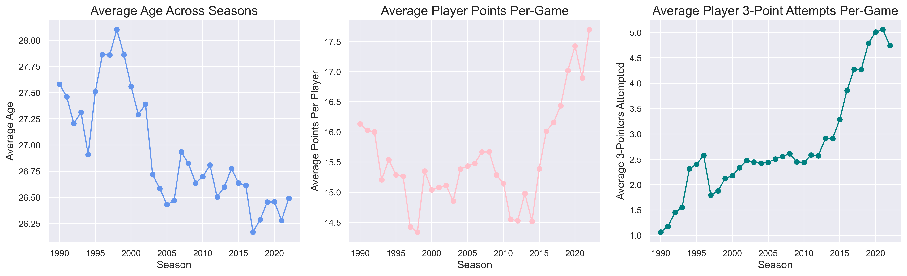
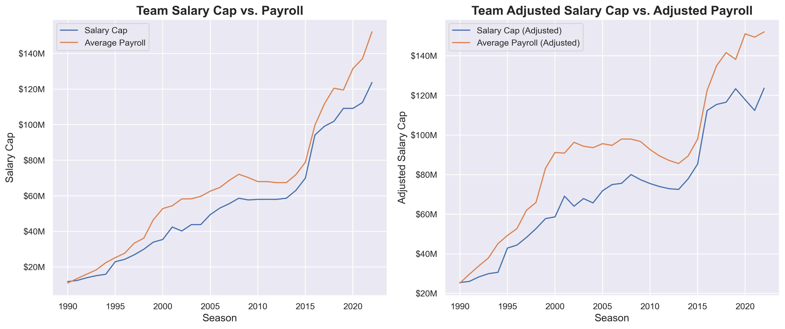
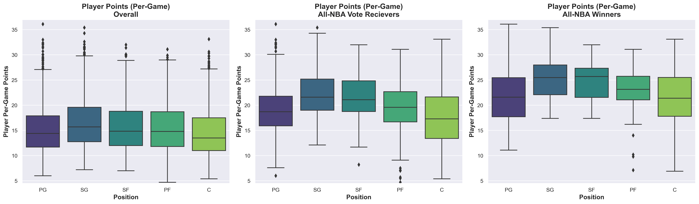
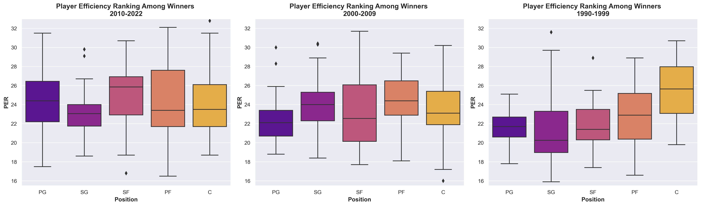
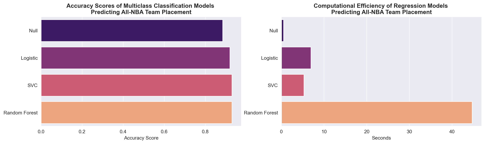
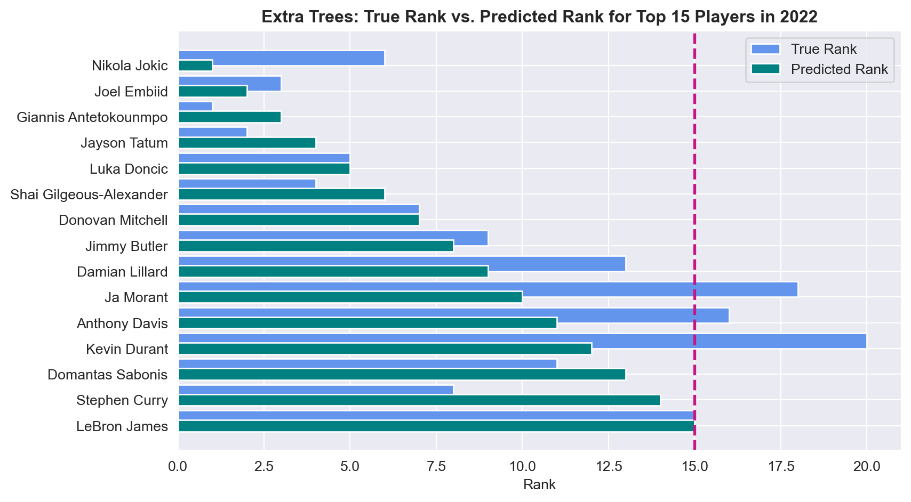

# Using Machine Learning and Sports Analytics to Optimize NBA Management and Decision-Making
---

<center><font size="3"><em>"Analytics are part and parcel of virtually everything we do now" - NBA Commissioner Adam Silver</em></font></center>

# Problem Statement

The National Basketball Association (NBA) has been increasing in popularity since it's inception in 1946, with the most drastic surge in viewership and fan engagement in the last few decades. Today, it is among the world's leading sports industries, fueled by factors such as expanding it's recruiting to the global sphere, exercising prowess in marketing, promotions, endorsements, and sponsorships, devising complex business contracts and collective bargaining agreements, partaking in \\$24B network deals, and ultimately generating over \\$10B in revenue ([_1_](https://www.premiumtimesng.com/promoted/596711-exploring-the-reasons-behind-the-success-of-the-nba.html))([_2_](https://randerson112358.medium.com/how-the-nba-uses-data-analytics-6eac3c43a096#:~:text=Most%20NBA%20teams%20have%20data,and%20track%20their%20fatigue%20levels)).

With the increase in viewership both domestically and internationally, as well as the shift towards becoming a serious business, the NBA presents abundant opportunities for management and analytics. Team executives, coaches, and decision-makers recognize the need to optimize their positions in the industry via data-driven strategies. It is more important than ever to hone and enhance each of the factors that contribute to team success, and ultimately, the bottom line of the industry.

Our objective is to help NBA team management stakeholders plan for the future of their franchise via predictive modeling and machine learning. One such way is to project and account for the salary negotiations that will take place with top and/or upcoming players. Here there exists a delicate balance between keeping top performers and assuring that team payroll is manageable. In this analysis, we have sought to proactively manage team circumstances by making a series of regression and classification models that predict: 1) All-NBA Team voter share and selection, and 2) player salaries based on performance. Our models successfully predict these targets, and therefore can be leveraged by management executives for optimal player evaluation, contract negotiation, and decision-making.

At the end of this assignment, NBA team and player stakeholders will be empowered to collaboratively create robust mutually beneficial opportunities, fostering synergy between their front office and players.

# Data Dictionary

The data sourced for this analysis came from various sports websites responsible for recording and maintaining NBA player statistics. A vast range of data was collected, below we will list the main features used in our models. However, for a complete glossary of all NBA statistics, most of which we scraped and explored, can be found here: [https://www.nba.com/stats/help/glossary](https://www.nba.com/stats/help/glossary_)

| Feature       | Type    | Source   | Definition                                                                                          |
|-----------------|---------|----------|-----------------------------------------------------------------------------------------------------|
| **age**             | *integer*   | NBA.com  | Age of the player                                                                                   |
| **g**               | *integer*   | NBA.com  | Games played                                                                                        |
| **pg_gs**           | *integer*   | NBA.com  | Games started                                                              |
| **pg_mp**           | *integer*   | NBA.com  | Per-Game minutes played                                                            |
| **pg_fg**           | *float*   | NBA.com  | Per-Game Field goals made                                                        |
| **pg_fga**          | *float*   | NBA.com  | Per-Game Field goals attempted                                                    |
| **pg_fg%**          | *float*   | NBA.com  | Per-Game Field goal percentage as a point guard                                                           |
| **pg_3p**           | *float*   | NBA.com  | Per-Game Three-pointers made |
| **pg_3pa**          | *float*   | NBA.com  | Per-Game Three-pointers attempted                                                   |
| **pg_3p%**          | *float*   | NBA.com  | Per-Game Three-point percentage                                                             |
| **pg_2p**           | *float*   | NBA.com  | Per-Game Two-point field goals                                               |
| **pg_2pa**          | *float*   | NBA.com  | Per-Game Two-point field goals attempted per game                                          |
| **pg_2p%**          | *float*   | NBA.com  | Per-Game Two-point field goal percentage                                                     |
| **pg_efg%**         | *float*   | NBA.com  | Per-Game Effective field goal percentage                                                    |
| **pg_ft**          | *float*   | NBA.com  | Per-Game Free throws made                                                           |
| **pg_fta**          | *float*   | NBA.com  | Per-Game Free throws attempted                                                     |
| **pg_ft%**          | *float*   | NBA.com  | Per-Game Free throw percentage                                                           |
| **pg_orb**          | *float*   | NBA.com  | Per-Game Offensive rebounds                                                      |
| **pg_drb**          | *float*   | NBA.com  | Per-Game Defensive rebounds                                                        |
| **pg_trb**          | *float*   | NBA.com  | Per-Game Total rebounds                                                            |
| **pg_ast**          | *float*   | NBA.com  | Per-Game Assists                                                                   |
| **pg_stl**          | *float*   | NBA.com  | Per-Game Steals                                                                   |
| **pg_blk**          | *float*   | NBA.com  | Per-Game Blocks                                                                    |
| **pg_tov**          | *float*   | NBA.com  | Per-Game Turnovers                                                               |
| **pg_pf**           | *float*   | NBA.com  | Per-Game Personal fouls                                                           |
| **pg_pts**          | *float*   | NBA.com  | Total points per game per player                                                                  |
| **tot_mp**          | *float*   | NBA.com  | Total minutes played in the season                                                                  |
| **tot_fg%**         | *float*   | NBA.com  | Total field goal percentage throughout the season                                                         |
| **tot_3p**          | *float*   | NBA.com  | Total three-pointers made throughout the season                                                     |
| **tot_3p%**         | *float*   | NBA.com  | Total three-point percentage throughout the season                                                        |
| **tot_2p%**         | *float*   | NBA.com  | Total two-point field goal percentage throughout the season                                               |
| **tot_efg%**        | *float*   | NBA.com  | Total Effective field goal percentage throughout the season                                               |
| **tot_ft%**         | *float*   | NBA.com  | Total Free throw percentage throughout the season                                                         |
| **tot_pf**          | *float*   | NBA.com  | Total personal fouls committed throughout the season                                               |
| **tot_pts**         | *float*   | NBA.com  | Total points scored throughout the season                                                           |
| **adv_per**         | *float*   | NBA.com  | Player Efficiency Rating (PER) - An advanced measure of a player's per-minute productivity                   |
| **adv_ts%**         | *float*   | NBA.com  | True Shooting Percentage - An advanced measure of shooting efficiency, accounting for field goals, three-pointers, and free throws |
| **adv_3par**        | *float*   | NBA.com  | Three-Point Attempt Rate - The percentage of field goal attempts that are three-pointers           |
| **adv_ftr**         | *float*   | NBA.com  | Free Throw Attempt Rate - The ratio of free throw attempts to field goal attempts                   |
| **adv_orb%**        | *float*   | NBA.com  | Offensive Rebound Percentage - An estimate of the percentage of available offensive rebounds a player grabs |
| **adv_drb%**        | *float*   | NBA.com  | Defensive Rebound Percentage - An estimate of the percentage of available defensive rebounds a player grabs |
| **adv_trb%**       | *float*   | NBA.com  | Total Rebound Percentage - An estimate of the percentage of available rebounds a player grabs        |
| **adv_ast%**        | *float*   | NBA.com  | Assist Percentage - An estimate of the percentage of teammate field goals a player assisted on       |
| **adv_stl%**        | *float*   | NBA.com  | Steal Percentage - An estimate of the percentage of opponent possessions that end with a steal by the player |
| **adv_blk%**        | *float*   | NBA.com  | Block Percentage - An estimate of the percentage of opponent two-point field goal attempts blocked by the player |
| **adv_tov%**        | *float*   | NBA.com  | Turnover Percentage - An estimate of turnovers per 100 plays                                       |
| **adv_usg%**        | *float*   | NBA.com  | Usage Percentage - An estimate of the percentage of team plays used by a player                     |
| **adv_ows**         | *float*   | NBA.com  | Offensive Win Shares - An estimate of the number of wins contributed by a player's offense         |
| **adv_dws**         | *float*   | NBA.com  | Defensive Win Shares - An estimate of the number of wins contributed by a player's defense         |
| **adv_ws**          | *float*   | NBA.com  | Win Shares - An estimate of the number of wins contributed by a player                             |
| **adv_ws/48**       | *float*   | NBA.com  | Win Shares per 48 minutes - An estimate of the number of wins contributed by a player per 48 minutes played |
| **adv_obpm**       | *float*   | NBA.com  | Offensive Box Plus-Minus (BPM) - A box score-based metric that estimates a player's offensive impact on the game |
| **adv_dbpm**        | *float*   | NBA.com  | Defensive Box Plus-Minus (BPM) - A box score-based metric that estimates a player's defensive impact on the game |
| **adv_bpm**         | *float*   | NBA.com  | Box Plus-Minus (BPM) - A box score-based metric that estimates a player's overall impact on the game     |
| **adv_vorp**        | *float*   | NBA.com  | Value Over Replacement Player (VORP) - The estimated points per 100 team possessions a player contributed above a replacement-level player |
| **w/l%**            | *float*   | NBA.com  | Team win percentage                                                |
| **seed**            | *float*   | NBA.com  | Team's playoff seed                                                                                |
| **all_star**        | *integer*   | NBA.com  | All-Star selection status - Indicates whether the player was selected for the All-Star game        |
| **pos_5**           | object   | NBA.com  | Player position in tradition 5 roles: PG = Point Guard, SG = Shooting Guard, SF = Small Forward, PF = Power Forward, C = Center       |
| **year**            | *float*   | NBA.com  | Season year                                                                                         |
| **salary_cap_adj**  | *float*   | NBA.com  | Adjusted salary cap for the season                                                                  |
| **career_length**   | *float*   | NBA.com  | Length of the player's career (so far) in the NBA                                                           |


# Executive Summary

## Background and Purpose

### NBA Rise in Popularity
The NBA has experienced a remarkable surge in popularity over the past few decades, solidifying its position as one of the world's premier sports leagues. With a global fan base, passionate viewership, and widespread media coverage, the NBA has become a cultural phenomenon, transcending borders and uniting fans from diverse backgrounds. Following a decrease in revenue (\\$6.4B in the 2020-21 season) due to the COVID-19 pandemic, the league set a revenue record of \\$10B in 2022 -- which nearly tripled the annual revenue over the last decade from \\$2.7B in 2012 ([_3_](https://huddleup.substack.com/p/the-nbas-10-billion-business)). 

The NBA's future continues to look bright and revenues are only projected to increase. The average NBA franchise is currently worth \\$2.48B, a 13% increase from just one season ago, and the average value of an NBA team has increased 12x since 2001 (\\$207M to \\$2.48B) ([_4_](https://huddleup.substack.com/p/the-nbas-10-billion-business)). As revenue increases, player contracts, team payrolls, and league salary caps are all projected to continue increasing in tandem. This makes it ever more crucial for players and teams to manage their contracts well and plan effectively for the future in ways that best position their teams for success.

Through machine learning, we can develop innovative ways to help NBA team managers plan their rosters and budgets, as well as make an impact on the league by continually raising the level of play. Sophisticated analytics can assist in player evaluations, salary management, injury prevention, team planning, and contract negotiations and budgeting, ultimately optimizing team performance and fostering success ([_5_](https://randerson112358.medium.com/how-the-nba-uses-data-analytics-6eac3c43a096#:~:text=Most%20NBA%20teams%20have%20data,and%20track%20their%20fatigue%20levels))([_6_](https://knowledge.wharton.upenn.edu/article/nbas-adam-silver-analytics-transforming-basketball/)). 


[Source: statista.com](https://www.statista.com/statistics/193467/total-league-revenue-of-the-nba-since-2005/)

### Player Salaries and All-NBA Team Selection
Player salaries make up a critical part of every teams planning process, as this impacts the team payroll, the taxes to be paid if the salary cap is exceeded, and ultimately the financial flexibility and competitiveness of the team in acquiring and retaining talent. Player salaries, along with other financial considerations, play a crucial role in shaping a team's roster, strategic decisions, and long-term success in the highly competitive landscape of the NBA. Many players have complex contracts, with incentive structures throughout based on performance and tenure with their team. 

For example, one way for a player to be eligible for a supermax contract, whereby a team can offer a longer and more lucrative deal (30-35% of the salary cap) compared to what other teams can offer the player free agency, is to be selected for an All-NBA Team: either 1st, 2nd, or 3rd teams ([_7_](https://www.hoopsrumors.com/2023/05/contract-implications-of-todays-all-nba-announcement.html))([_8_](https://en.as.com/nba/how-can-all-nba-teams-selection-affect-players-salaries-n/)). This offers a huge incentive for players, especially upcoming players who are not eligible for more than 25% of the salary cap, to be selected among the Top 15 in the league (Top 5 in 1st Team, next 5 in 2nd Team, last 5 in 3rd Team). Players receiving this league honor -- via votes cast by a group of respected sportswriters and broadcasters -- are able to make strong cases for contract negotiations, and team management executives must be prepared to make space for such negotiations whilst keeping a robust team around their "star" players.

For team management to be able to effectively navigate and forecast when these potential negotiations would take place and how much they should plan to budget, data science and modeling can be productively leveraged. We built a regression model which can accurately predict the percent of voter share a player is predicted to receive based on their performance, impact, and tenure. We used this voter share to predict the Top 15 players selected: the All-NBA Teams. We also took a more granular look at which specific team -- 1st, 2nd, or 3rd -- a player would make via classification modeling. With these insights, any stakeholder involved in team analytics and planning can impactfully be a step ahead of team management activities.

### Player Salaries and Over/Undervalued Players
Another valuable insight to be gained from current or anticipated player salaries is whether or not a contract over- or undervalues a player. By using another regression model, this time predicting player salary based on performance statistics and league tenure, we were able to determine which players may currently make too much or too little salary as percent of the league salary cap. Based on robust modeling that looks for complex relationships in historical data, we are able to make inferences about current player salaries which can leveraged by players and management alike in contract negotiations.

With the use of our models, players, agents, and management/ownership groups will be able to more effectively manage their contracts/careers or teams, make business decisions, handle financial matters, and oversee day-to-day operations. 

### Note About Future Uses of Our All-NBA Prediction Model
On July 1, 2023, the new 7-year collective bargaining agreement (CBA) was signed and will run through 2029-30. Starting in the 2023-24 season, All-NBA Team selection will be "positionless". In contrast to how current voting takes place, whereby voters select 2 Guards, 2 Forwards, and 1 Center per All-NBA team, moving forward, position will no longer be a factor. Voters will cast votes for only the Top 15 players, regardless of position.

Our models will still be valuable in a positionless setting, as it will still capture insights into the past patterns of voting and identify the factors that influenced the selection of players. Our model uses regression to predict voter share, and I anticipate it will only take a few seasons for the model to understand the relationships in a positionless setting. By acknowledging the changes in voting criteria, incorporating new features, and continuously improving the model based on feedback and real-world outcomes, we will enhance its predictive capabilities and ensure it remains relevant and effective in predicting All-NBA Team selections in a positionless context.

Read the CBA [here](https://ak-static.cms.nba.com/wp-content/uploads/sites/4/2023/06/2023-NBA-Collective-Bargaining-Agreement.pdf) and see summaries [here](https://ak-static.cms.nba.com/wp-content/uploads/sites/4/2023/06/2023-CBA-Summary.pdf) and [here](https://theathletic.com/4421655/2023/04/17/cba-minimum-games-mvp-awards/).

## Initial Findings
### Baseline Models
In order for our models to be useful, they needed to outperform the baseline models. 
- **All-NBA Team Regression Model**
    - Baseline: 0.0681 (mean of all past voter shares, similar value when took the average voter share by season and then averaged across that)
    - RMSE: 0.2009
    <br></br>
- **All-NBA Team Classification Models (Multi-Class and Binary)**
    - Baseline: 0.8842
    <br></br>
- **Player Salary**
    - Baseline: 0.1455 (mean of all cap-shares [salary as a percent of salary cap])
    - RMSE: 0.104

### Final Model Performance
- **All-NBA Team Regression Model**
    - Model: Extra Trees
    - Testing Score: 0.8274
    - RMSE: 0.0832
    <br></br>
- **All-NBA Team Multi-Class Classification Models**
    - Model: SVM
    - Accuracy Score: 0.9355
    <br></br>
- **All-NBA Team Binary Classification Models**
    - Model: Logistic Regression
    - Accuracy Score: 0.9642
    <br></br>
- **Player Salary**
    - Model: LGBM
    - Testing Score: 0.7591
    - RMSE: 0.0527
    
### General Insights
- There have been significant changes in the landscape and ecosystem of the NBA since 1990
    - Average age of players has decreased from >28 in 1998 to 26.5 in 2022
    - Average points per game has increase, likely consistent with higher entertainment value being incentivize as viewers increase
    - Average 3-pointers attempted per game has increased dramatically, this can be credited to data science and efficiency analysis
    - Team salary caps and payroll have been increasing year over year significantly, at rates much beyond inflation (having to do with growth in viewership and revenue, e.g., after the 2014 television deal)
    




#### All-NBA Placements
- Once the Top 15 players are decided, granular placements from there are subject to much nuance, noise, and other external factors beyond statistics. This was made evident by high levels of misclassification in the our SVM multi-class classification model.
- Many statistics among 1st, 2nd, and 3rd team are not significantly different, such as player efficiency ranking, box score, and win share

#### Salary 
- There is very high variability in NBA player salaries, even among players with similar skill levels. Factors such as experience, performance, reputation, and market demand can lead to substantial differences in compensation.
- Many star players will often show up as "Overvalued" (i.e., the difference between their actual and predicted salary is within the Top 25% of differences), as their salary often takes up a significant amount of the salary cap compared to the final algorithm used by our models.
    - Giannis Antetokounmpo, Nikola Jokic, Joel Embiid, Lebron James, and Kevin Durant were all listed as overvalued, despite high accomplishments and performance. For all these instances, the model predicted high salaries, just not _as_ high as their actuals. These players are often who teams are built around, therefore, our model must be taken in conjunction with domain knowledge to be most useful
- Role players, especially those on winning teams, are often undervalued. 
    - Demar DeRozan is a 12 year veteran starting for Golden State, he was named to the 3rd All-NBA Team and was an allstar. He is competing for salary cap share among superstars like Steph Curry and Klay Thompson, therefore his compensation may not be as high. 
    - However, as he _was_ selected as an All-NBA winner, he is subject now to negotiate a deeper contract - this may put Golden State too far beyond the salary cap to be comfortable, but it is also important they retain and reward strong role players. Our model can help anticipate situations like these and proactively engage.    
    
## Methodology and Analysis
To complete this analysis, several regression and classification models were trained and fit on historical NBA data from 1990-91 season to 2022-23 season. Before modeling could begin, we had a variety of tasks, from data pulling, to cleaning and feature engineering, to exploration. The high-level process for this analysis is outlined below.

### 1. Data Acquisition 
Predicting All-NBA Team and player salaries required an abundant amount of performance data which is available across several statistics sites, including [nba.com/stats](https://www.nba.com/stats), [basketball-reference.com](https://www.basketball-reference.com/), and [hoopshype.com](https://hoopshype.com/salaries/). Webscraping across all these sites was required to access and pull all the needed data. 

#### Data Scraped
Ultimately, the data scraped on all active players and teams from 1990-2022 included:
1. **Player Data**
    - Performance Statistics
        - Per Game
        - Totals
        - Advanced
    - NBA Draft Year
    - All-Star Selection and Number of Appearances
2. **All-NBA Team Data**
    - Winners
    - Vote-Receivers
3. **Team Data**
    - Team Rankings
    - Team Standings
4. **Salary Data**
    - Player
    - Team Payroll
    - Salary Caps
    
#### Process for Scraping
Using webscraping methods BeautifulSoup and Selenium, we first saved a snapshot of the HTML page housing our desired statistics. We then used those pages to inspect and pull the tables the interest into CSV's for further data cleaning and feature engineering. Below we describe the two scenarios encountered in our webscraping journey.

1. **Traditional Full-Page Reloading / Synchronous Loading**
    - For websites which fully reloaded from the server upon user interaction, our process was straightforward. The server would process the request, generate a new HTML page, and send it back to our browser with our full data available for inspection and scraping. 
    - We employed ```BeautifulSoup```, inspected the HTML, and were able to scrape only our tables of interest. 
    <br></br>
2. **AJAX (Asynchronous JavaScript and XML)**
    - For websites that employed a dynamic implementation using AJAX, the displayed tables were absent in the HTML document and BeautifulSoup could not be used. For these dynamic tables, our tables/rows would be rendered using JavaScript only after the page had fully loaded.
    - We leveraged the ```Selenium``` Python package, an automated browser software, for these instances. With this, we were able to dynamically interact with web pages and simulate user actions like clicking buttons, filling out forms, and navigating through various elements. 
    - For further instructions on how to install and use Selenium and it's associated webdriver, see my [Data Acquisition](./code/01_Data_Acquisition.ipynb) notebook.
 
We ensured respectful and responsible webscraping by incorporating random sleep times / rate limits of 4-6 seconds (continuous) between data pulling requests to prevent server overload and potential IP blocking.

### 2. Data Cleaning
Once our data was scraped, a vast amount of data cleaning was necessary to combine all dataset, reconcile differences, explore and fill in missings, and engineer variables that would be useful for future modeling. Our rough steps, considerations, and decisions are outlined below.

1. We built a <u>**foundational dataset**</u> by merging per-game, advanced, and total statistic
    - Each dataset required various amounts of initial cleaning, including:
        - Removing any Unnamed columns that made their way into our final scraped data
        - Removing rows which were repeat headers, also a byproduct of the HTML tables before they were scraped
        - Convert Objects to Floats
        - Prefix variables with statistic type ```pg_```, ```adv_```, ```tot_``` to enable smooth merging
     - Further manipulations needed to be made to the data once merged, for example...
        - Dummifying the Position (```Pos```) variable into 3 categories for All-NBA Team prediction and 5 categories for our salary model
        - Managing players with midseason transfers
            - These players appeared across multiple rows in our data, once for each team they played for throughout a single season. We took only the "TOT" (i.e., Total) statistics row, and for the players' Team, we listed the team they finished season with (i.e., their 'latest' team)
            - Many player names contained special characters, such as asterisks, to indicate whether a player was the MVP that season. We deleted these special characters and did not store MVP data elsewhere as this would not available yet in determining future All-Team winners. There were also special characters such as accents in player names, which we scrubbed appropriately via the ```unicodedata.normalize``` function
            <br></br>
2. Once our base dataset was built, we established a <u>**Minimum Selection Criteria**</u> for All-NBA candidates based on historical lows. Players not meeting these qualifications would not be in our model, as they would create noise and not be useful for model training. The minimum criteria included:
    -   Minimum Number of Games Played: 41
        - Gus Johnson (1965-66 season) had 41 games played when selected as All-NBA team winner (2nd team)
    - Minimum Number of Minutes Played Per Game: 26
        - Bob Cousy (1962-63 season) had 26 minutes per game played when selected as an All-NBA team winner (1st team)
    - Minimum Points Per Game: 6.9
        - Ben Wallace (2002-2003 season) had 6.9 ppg when selected as an All-NBA team winner (2nd team)
    - Minimum Player Efficiency Ranking: 11
        - Slater Martin (1957-58 & 1958-59 seasons) had a 9.3 PER when selected as an All-NBA team winner (2nd team)
        - We capped our results at 11, which was close to the next lowest amount, as 9.3 seems anomalous and this data may be outdated based on current-day voting standards; 11 is still well below the league average of 15.
    - Minimum Selection Criteria starting in the 2023-24 season
        - Based on the July 1, 2023, 7-year CBA, players will need to be on the floor for 20 minutes in at least 65 games to be eligible for honors including NBA MVP and All-NBA teams. We put these filtering criteria in place for 2023 and onwards in our model.
<br></br>
3. With our pared down data, we then <u>**finalized our player data**</u> with the following:
    - Added All-Star participation indicator
    - Incorporated draft data, including:
        - NBA Draft Year 
        - Overall draft pick
            - Overall draft picks for undrafted players who were signed as walk-ons or free-agents was imputed as 1000
        - Built a subsequent ```career length``` variable
    - Cleaned and incorporated salary data:
        - For players with partially missing salary data (e.g., missing some seasons of information but not all), salaries were imputed with their players average salary
        - For players with completely missing salary data, the seasons average salary was imputed 
        - Data was merged by player name and season; as such, player names were investigated and updated to match in spelling for correct merging to take place (e.g., ‘PJ Brown’ was mapped to ‘P.J. Brown’, 'Hidayet Turkoglu' was mapped to "Hedo Turkoglu", 'Maurice Williams' was mapped to "Mo Williams", etc.)
<br></br>
4. Next, we focused on <u>**processing and merging in team data**</u>, by doing the following:
    - Integrated team rankings/seed and win percentages
    - Generated variable for which team won the championship that season, accompanied by a binary indicator ```championship_won```
    - Merged in Salary Cap data (unadjusted and adjusted for inflation)
    - Merged in Team Payroll data (unadjusted and adjusted for inflation)
        - Missing data was researched separately and merged in
    - Reconciled data for the Charlotte Bobcats who changed names and abbreviations and relocated a few different times
<br></br>
5. Lastly, <u>**missing values**</u> were assessed and all features were snake-cased and stripped of any potential leading and trailing spaces
    - The only missing values left included some 3-point percentage statistics (```3P%```), which existed because the player did not attempt any 3-pointers that season. This if valid for some players, such as true Centers who focus garnering their point share from the paint. For these few players, we imputed 3P% with 0, and were confident it would not cause disruption.

### 3. Data Exploration and Visualization
With our cleaned data, we conducted preliminary exploration on our target variables of interest: All-NBA Team Voter Share (```share```) and player salary (```salary```). We focused primarily on distributions and the impact of different statistics on each other and on our targets. The following are the different views explored.

- **Age Distributions** - The average age of the NBA over seasons
<br></br>
- **Championship Count** - The number of championships won by team/franchise
<br></br>
- **Statistics Correlation Matrices** - Correlation between all numeric values
    - Per-Game statistics
    - Advanced statistics
     <br></br>
- **Players With Most Selections** - A stacked bar chart of players with the most All-NBA Team selections, broken out by 1st, 2nd, and 3rd Teams
<br></br>
- **Variable Associations** - A pairplot showing main player statistics against our target variables
<br></br>
- **Distributions of Various Performance Statistics**
    - PER, PPG, VORP by Position - Scatterplots showing player efficiency rate, points per game, and value over replacement player among overall and among All-NBA winners 
    
    <br></br>
    - PER and TS% by Position Among Winners - Boxplots looking at player efficiency and true shooting percentage over 10-year intervals to see evolution over time
    
    <br></br>
    - PER and BPM Comparison Among 1st, 2nd, & 3rd Team - Violin plots observing player efficiency and play box scores among 1st, 2nd, and 3rd Team winners
    
    <br></br>  
    - Win Share by PER, VORP, & BPM - Scatterplots of player win-shares across various statistical components
    
    <br></br>  
- **Salary Information Exploration**
    - Salary Distributions Across Years - Histogram visualizing the salary distributions currently, 10 years ago, 20 years ago, and 30 years ago
    - Salary Cap vs. Team Payroll - Double-line chart of salary cap and average team payrolls over the seasons
    - Salary Cap Differential: Amount Spent Above/Below the Salary Cap - Histogram visualizing the distribution of differences between the salary cap and team payroll currently, 10 years ago, 20 years ago, and 30 years ago
    - Salary Cap Differential by Win Percentage - Scatterplot of the difference between the salary cap and team payroll, highlighting championship winners
    
    <br></br>
    - Salary Distribution by All-NBA Selection - Violin plots and boxplots of salary distribution broken out by 1st, 2nd, and 3rd Teams, as well as position
    - PER by Salary and All-NBA Selection - Scatterplot visualizing player efficiency ratings and salary, highlight All-NBA Team placement
    
    <br></br>
    - Career Length and Salary - Scatterplot showing the pattern between career length and salary, broken out by All-NBA Team placement

### 4. Data Modeling
#### Pre-Processing and Modeling
Once our data was completely cleaned, manipulated, and explored, data transformation and modeling took place via pipelining and hyperparameter tuning. Because out data cannot be shuffled due to it's seasonal/annual natures, rather than a traditional train/test/split, we manually setup out data into three parts:
1. Training Data - 1990-2016 seasons
2. Validation Data - 2017-2020
3. Holdout/Final Testing Data - 2021-2022

We begun testing our various regression and classification models using one transformer (StandardScaler) and one estimator (our chosen model) via pipeline automation and GridSearchCV with cross validation. Ultimately, 8 models were tested to predict All-NBA voter share, 3 to predict the All-NBA category, and 9 to predict player salary. Appropriate error metrics such as R^2 and RMSE were examined for the regression problems, and confusion matrices and accuracy reports for the classifications. 

For operationalizing our voter share predictions, we generated a new error metric: Average Precision (AP). This is a popular evaluation metric for ranking and sports-related predictions. It takes into account both the accuracy of the predictions and the order in which they are presented, effectively measuring how well the model ranks the top players or teams correctly. 

To calculate average precision, we built a function that did the following:
1. Sorted the voter share predictions in descending order
2. Calculated the precision at each position for the top-K predictions (K being the number of positive/correct instances). For example, as we were interested in predicting the Top 15 players, we would receive full 'credit' for any predictions of ours that aligned with the Top 15 actuals (even if the ranks were not exactly the same)
3. Averaged the precision values at each position to get the AP score
    - Our AP metric penalized incorrect or out-of-order predictions (i.e., predictions that were not in the Top 15 when the actuals were in the Top 15) and rewards accurate rankings. This made it particularly suitable for our task that was ranking top players based on their performance and our predictions
    
Below is a summary of each model and the parameters tuned.

- **Predicting All-NBA Voter Share**
    1. <u>**Model 1**</u>: Support Vector Regression (C, kernel, degree, gamma, epsilon)
    2. <u>**Model 2**</u>: Random Forest (n_estimator, max_depth, max_features)
    3. <u>**Model 3**</u>: Elastic Net (alpha, l1_ratio, max_iter)
    4. <u>**Model 4**</u>: Extra Trees (n_estimators, max_depth, max_feature, min_samples_leaf)
    5. <u>**Model 5**</u>: Gradient Boost (n_estimators, max_depth, learning_rate, alpha)
    6. <u>**Model 6**</u>: Extreme Gradient Boost (n_estimators, max_depth, learning_rate, reg_alpha)
    7. <u>**Model 7**</u>: AdaBoost (n_estimators, learning_rate)
    8. <u>**Model 8**</u>: Light Gradient Boost Machine (n_estimators, max_depth, learning_rate, num_leaves)
    <br></br>
- **Predicting All-NBA Team Placement/Selection (Multi-Class and Binary)**
    1. <u>**Model 1**</u>: Logistic Regression (C, penalty, max_iter)
    2. <u>**Model 2**</u>: Support Vector Classification (C, kernel, degree)
    3. <u>**Model 3**</u>: Random Forest Classifier (n_estimators, max_depth, max_features, min_samples_leaf, min_samples_split)
    <br></br>
- **Predicting Player Salary**
    1. <u>**Model 1**</u>: Linear Regression
    2. <u>**Model 2**</u>: Lasso Regression (alpha, cv, max_iter)
    3. <u>**Model 3**</u>: Ridge Regression (alpha, cv, scoring)
    4. <u>**Model 4**</u>: Support Vector Regression (C, kernel, degree, gamma, epsilon)
    5. <u>**Model 5**</u>: Elastic Net (alpha, l1_ratio, max_iter)
    6. <u>**Model 6**</u>: Random Forest Regressor (n_estimators, max_depth, max_features)
    7. <u>**Model 7**</u>: AdaBoost (n_estimators, learning_rate)
    8. <u>**Model 8**</u>: Extreme Gradient Boost (n_estimators, max_depth, learning_rate, reg_alpha)
    9. <u>**Model 9**</u>: Light Gradient Boost Machine (learning_rate, max_depth, n_estimators, num_leaves)

#### Modeling Considerations
<u>Principal Components Analysis</u> was tested and considered to pare down our variables into the most important ones that captured most variance. However, running these components through our models did not yield as high of results as using the <u>Feature Importances</u> or coefficient attributes. As such, the latter was used to select the most optimal features for our models.  

Several target variables for predicting player salary were tested, including salary (```salary```), the adjusted salary (```sal_adj```), the log of the adjusted salary (```log_sal```),  the player's salary as a percent of the salary cap (```pct_cap```), and the log of ```pct_cap```. Ultimately, we chose the the percent of the salary cap (```pct_cap```), as our model was appearing to perform best with this variable. 

#### Model Performances
After training the data and fitting it to the validation set, the best performing models were chosen. They were then retrained on both the training and validation sets, and fitted to the holdout data. Each model outperformed the baseline significantly, but each model performed similarly in terms of accuracy. For details on the final models selected, see subsequent section.

<u>**Predicting All-NBA Voter Share - Regression**</u>


<u>**Predicting All-NBA Team Placement - 1st, 2nd, or 3rd Teams - Multiclass Classification**</u>

<div align="center">

</div>    
Our precision for this model was high, however predicting 1st, 2nd, and 3rd teams was subject to much misclassification. The sensitivity for 1st Team predictions was 80%, 2nd Team was 30%, and 3rd Team was 10%.
<br></br>

<u>**Predicting All-NBA Team Selection - Selected or Not Selected - Binary Classification**</u>
<div align="center">

</div>
<div align="center">

</div><br></br>

<u>**Predicting Player Salaries - Regression**</u>


#### Final Models

After a strenuous process of webscraping/data acquisition, data cleaning and feature engineering, and building several regression and classification models, we successfully ran our trained and fitted models on completely unseen data: the most recent 2021-22 and 2022-23 NBA seasons. Our final models chosen and their performance were as follows:
    
1. <span style = 'color:orange'><u>**Predicting All-NBA Voter Share**</u></span>
    - <span style = 'color:orange'>We used predicted voter share to apply AP metrics and ultimately forecast the Top 15 players per season. These players were the predicted All-NBA Team, and we compared our rankings to the actual rankings.</span>
    - <span style = 'color:orange'>**Model: Extra Trees**</span>
        - <span style = 'color:orange'>Parameters tuned/selected: </span>
            - <span style = 'color:orange'>'et__max_depth': 20, </span>
            - <span style = 'color:orange'>'et__max_features': 4, </span>
            - <span style = 'color:orange'>'et__min_samples_leaf': 1, </span>
            - <span style = 'color:orange'>'et__n_estimators': 175</span>
    - <span style = 'color:orange'>Baseline Model: 0.0681</span>
    - <span style = 'color:orange'>Testing Score: 0.8274</span>
    - <span style = 'color:orange'>RMSE: 0.0832</span>
    - <span style = 'color:orange'>Average Precision:</span>
        - <span style = 'color:orange'>2021: 0.939</span>
        - <span style = 'color:orange'>2022: 0.902</span>
     
2. <span style = 'color:dodgerblue'><u>**Predicting All-NBA Team Placement**</u></span>
    - <span style = 'color:dodgerblue'>We used the 1st, 2nd, and 3rd Team placements as our target variable to determine which players make which specific team.</span>
    - <span style = 'color:dodgerblue'>Model: SVM</span>
        - <span style = 'color:dodgerblue'>Parameters tuned/selected: </span>
            - <span style = 'color:dodgerblue'>'svc__C': 0.45222222222222225,</span>
            - <span style = 'color:dodgerblue'>'svc__degree': 2,</span>
            - <span style = 'color:dodgerblue'>'svc__kernel': 'rbf'</span>
    - <span style = 'color:dodgerblue'>Baseline Model: 0.8842</span>
    - <span style = 'color:dodgerblue'>Accuracy Score: 0.9355</span>
    - <span style = 'color:dodgerblue'>Sensitivity: </span>
        - <span style = 'color:dodgerblue'>1st Team: 0.80</span>
        - <span style = 'color:dodgerblue'>2nd Team: 0.30</span>
        - <span style = 'color:dodgerblue'>3rd Team: 0.10</span>

3. <span style = 'color:teal'><u>**Predicting All-NBA Team Selection**</u></span>
    - <span style = 'color:teal'>As an add-on to our regression model, we used All-NBA Team selection (binary, 1/0) to predict overall All-NBA team selection.</span>
    - <span style = 'color:teal'>Model: Logistic Regression</span>
        - <span style = 'color:teal'>Parameters tuned/selected: </span>
            - <span style = 'color:teal'>'logr__C': 0.05,</span>
            - <span style = 'color:teal'>'logr__max_iter': 750,</span>
            - <span style = 'color:teal'>'logr__penalty': 'l1'</span>
    - <span style = 'color:teal'>Baseline Model: 0.8842</span>
    - <span style = 'color:teal'>Accuracy Score: 0.9642</span>
    - <span style = 'color:teal'>Sensitivity: </span>
        - <span style = 'color:teal'>Positive Class: 0.8333</span>
        - <span style = 'color:teal'>Negative Class: 0.9799</span>
    
4. <span style = 'color:mediumvioletred'><u>**Predicting Player Salaries for Valuation**</u></span>
    - <span style = 'color:mediumvioletred'>We transformed player salary into the percent of the salary cap used on the player, and predicted this percentage based on player statistics, all-star appearances, and career length.</span>
    - <span style = 'color:mediumvioletred'>Model: LGBM</span>
        - <span style = 'color:mediumvioletred'>Parameters tuned/selected: </span>
            - <span style = 'color:mediumvioletred'>'lgb__learning_rate': 0.07999999999999999, </span>
            - <span style = 'color:mediumvioletred'>'lgb__max_depth': 12 </span>
            - <span style = 'color:mediumvioletred'>'lgb__n_estimators': 100, </span>
            - <span style = 'color:mediumvioletred'>'lgb__num_leaves': 20</span>
    - <span style = 'color:mediumvioletred'>Baseline Model: 0.1455</span>
    - <span style = 'color:mediumvioletred'>Testing Score: 0.7591</span>
    - <span style = 'color:mediumvioletred'>RMSE: 0.0527</span>

Our models considered several factors: the applicable error metrics (testing score/R^2/accuracy score, RMSE, AP score) and computational efficiency. The latter is very important as this model will be reused annually and retrained on all data regularly as more statistics become available as the season progresses.

### 5. Key Findings and Insights 

Based on this exploration, below are key insights drawn in applying our models to recent NBA season data.

- There have been significant changes in the NBA in the past 30 years: player ages have decreased, points per game have increased, and 3-point shooting has become a much larger part of team strategies towards point-scoring efficiency

- The most important features in predicting voter share, and ultimately Top 15 players rankings via Average Precision are depicted below.
<div align="center">

</div>
- The most important features in predicting player salary (reflected by salary as a percent of the salary cap) are depicted below. 
<div align="center">

    </div>

- Classifying players into All-NBA Teams is overall possible with a high accuracy rate (~93.55%). However, multi-class classification struggles to find patterns that accurately place the Top 15 players into 1st, 2nd, and 3rd Team categories, and therefore is subject to much misclassification. This suggests that, among the Top 15 players, further granular placements are beyond statistics, and may involve much more subjectivity. 
    - This produces a valuable opportunity to perform other types of deep learning among this selective cohort, including but not limited to:
        - Sentiment analysis
        - Interaction metrics that extend beyond the individual player player, such as team seed/rank and player interaction
        - Statistics not typically captured in standard performance data, such as number of comeback wins, number of game-winning shots, off-the-court leadership, off-the-court-issues, etc. <br></br>

- Our All-NBA predictive model proved that there are sometimes factors at play other than statistics when it comes to selecting players to All-NBA teams, as every season there are notable 'snubs'
    - In 2021, Jimmy Butler had led the Miami Heat to two conference finals appearances in the past 3 years and helped the Heat to get the 1st seed in the Eastern Conference. However, Pascal Siakam was selected to the All-NBA team as his Raptors team did not have as impressive of a roster as the Heat, making him easier to notice and acknowledge.
    - Rudy Gobert was not chosen, despite a high-performing season, potentially due to him having made the NBA's All-Defensive First Team, causing voters to want to diversify.
    <div align="center">
    
    </div><br>
    - In 2022, Ja Morant was notably left off after previously facing off-the-court issues shortly before voting took place.
    - Anthony Davis, in 2022, led the Lakers to a successful season but was sidelined due to a foot injury after 56 games. Kevin Durant, similarly, was highly efficient during his time on the court, but it was cut short due to midseason trades and injuries.
    <div align="center">
    
    </div>

- Extra attention should be given to role players, who often are undervalued but contribute greatly to team success and dynamics. 
    - Aaron Gordon was a key players helping to lead the Denver Nuggets to their first championship in franchise history in the 2022-23 season, but our model predicts his salary cap share is ~5% (~$6.2M) lower than what his performance indicates is fair. Especially now with a championship earned, management should be prepared for salary negotiations and understand what percentage amount increase is fair.
    - Julius Randle is among the most undervalued players in 2022, his percent of share in the salary cap is is marked as approximately 10% below where his performance indicates is appropriate. He also made the All-NBA team in the 2022 season, therefore, management can expect a contract re-negotiation and our model can help them gauge fair compensation.

### 6. Conclusion and Next Steps

Based on the insights derived from this analysis, we propose the following key recommendations for NBA team management. These strategic actions will not only enhance team performance but also enable proactive financial planning and informed decision-making for building and maintaining a robust team. We recommend the NBA managers use our model for the following areas: 
 
- <u>**_Long-Term Contract Decisions_**</u>: Utilize the model's player projections to make well-informed decisions on long-term contracts. Assessing player performance against predicted outcomes will minimize risk and maximize return on investment.
    - Anticipate contract negotiations, especially among those who are predicted to make the All-NBA team, and understand what fair compensation looks like, according to our robust models based primarily on statistics.

- <u>**_Salary Cap Management_**</u>: Adopt a pragmatic approach to salary cap management by considering the model's player valuations and predicted performances. With the models predictions, find a balance between player compensation and performance expectations to ensure optimal resource allocation.

- <u>**_Player Development Strategies_**</u>: As much as our model can identify strong players, it can identify struggling ones. Use our model to organize players statistics and implement targeted player development programs to help players focus on areas they are struggling.

- <u>**_Player Retention Strategies_**</u>: Identify key players whose performances surpass expectations and implement retention strategies to secure their long-term commitment to the team. Recognizing and valuing exceptional talent will promote team loyalty and stability.
    - Focus on undervalued players, as predicted by our model, and role players. 
    - Use our model to negotiate fair compensation or put additional clauses in player contracts that make it clear their contributions are valued.
<br></br>
- <u>**_Collaborate with Analytics Department_**</u>: It is clear that analytics are at the forefront of taking teams to the next level via data-driven insights and decision-making. As such, expand and collaborate with team analytics departments to continue to apply and refine our model and build additional ones. 
    - Continuously refine and update the predictive model with the latest data and advanced techniques. Enhancing the model's accuracy over time will ensure its relevancy and effectiveness in guiding team management decisions.
    - Begin building a model with new statistics that quantify and capture missing components in our current model determining 1st, 2nd, and 3rd All-NBA team placement. Data that cannot be easily 
    
By leveraging our models, all stakeholders responsible for NBA team financials and management can gain valuable insights that will elevate team and player performance. With the power of machine learning and data analytics offered by our models, the management office will be empowered to effectively target players and contracts with whom early engagement is needed for future team planning. 

To adapt to the evolving landscape of the typical NBA season, year over year, important next steps for NBA team management should also be the <u>regular retraining and recalibration</u> of the model using updated data. Stakeholders should consistently be gaining insights into team dynamics and player contributions to assure informed decision-making, foster strategic player development, and optimize overall team performance.